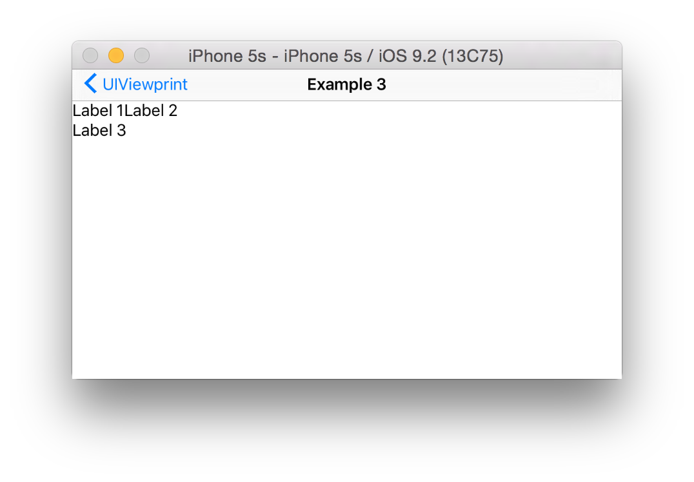

# &lt;UIViewprint/&gt;
[](https://developer.apple.com/swift)

[](https://github.com/s4cha/Stevia/blob/master/LICENSE)


iOS view layout completely reimagined

> **Blueprint** /ˈbluːˌprɪnt/ : a detailed outline or plan of action:
a blueprint for success.


```
class ViewController1: UIScrollViewableController {
    
    var sellerItem = UIViewable()
    var categoryItem = UIViewable()
    var compatibilityItem = UIViewable()
    
    override func viewDidLoad() {
        super.viewDidLoad()
        
        let appDetails = AppDetails()
        appDetails.name = "Day One 2 Journal + Notes"
        appDetails.developer = "Bloom Built, LLC"
        appDetails.rating = " 4+"
        appDetails.category = "Lifestyle"
        appDetails.price = "4.99"
        appDetails.reviews = 385
        appDetails.editorsNotes = "It's hard to make the best even better, but the sequel to Day One lives up to the expectations -- and then some."

        super.scrollView
            < .view+>
                < .view(style(height:10))>>
                < .flexRow()+>
                    < width(10)>>
                    < image("logo").width(80).height(80).style(logoStyle)>>
                    < width(10)>>
                    < .view+>
                        < .flexRow()+>
                            < appDetails.name>>
                            < label(appDetails.rating, style:ratingLabelStyle).width(20)>>
                            < width(10)>>
                        < .view/>
                        < .view+>
                            < label("\(appDetails.developer)", font:.systemFontOfSize(12))>>
                            < label(" >", font:.systemFontOfSize(11))>>
                        < .view/>
                        < .view+>
                        < label("Editors' Choice", style:editorsChoiceLabelStyle)>>
                        < .view/>
                        < .flexRow()+>
                            < .view(style(.Flex(.Row), align:.Bottom(.Left)))+>
                                < .view(style(.Flex(.Row), align:.Middle(.Left), width:55))+>
                                    < CircleView(frame:CGRect(x:0, y:0, width:10, height:10))>>
                                    < CircleView(frame:CGRect(x:0, y:0, width:10, height:10))>>
                                    < CircleView(frame:CGRect(x:0, y:0, width:10, height:10))>>
                                    < CircleView(frame:CGRect(x:0, y:0, width:10, height:10))>>
                                    < CircleView(frame:CGRect(x:0, y:0, width:10, height:10))>>
                                < .view/>
                                < label("(\(appDetails.reviews))", font:.systemFontOfSize(10))>>
                            < .view/>
                            < width(50).height(20).style(priceStyle)+>
                                < .view(style(.Inline, width:3))>>
                                < label("+", font:.boldSystemFontOfSize(8)).align(.Top(.Left))>>
                                < label("$\(appDetails.price)", font:.boldSystemFontOfSize(12)).align(.Middle(.Left))>>
                            < .view/>
                            < width(10)>>
                        < .view/>
                    < .view/>
                < .view/>
                < height(10)>>
                < .flexRow()+>
                    < width(10)>>
                    < image("logo").width(15).height(15).style(watchLogoStyle)>>
                    < width(5)>>
                    < label("Offers Apple Watch App for iPhone", style:watchLabelStyle).align(.Middle(.Left))>>
                < .view/>
                < height(10)>>
                < segment(items:["Details", "Reviews", "Related"], color:.grayColor()).align(.Top(.Center))>>
                < hr(padding(top:10), color:.lightGrayColor())>>
                < .flexRow()+>
                    < width(10)>>
                    < .view+>
                        < .view(style(height:40))+>
                            < label("App Store Editors' Notes").align(.Middle(.Left))>>
                        < .view/>
                        < label(appDetails.editorsNotes, display:.Block, font:.systemFontOfSize(12))>>
                        < hr(padding(top:10, bottom:10), color:.lightGrayColor())>>
                        < label("Supports", display:.Block)>>
                        < height(10)>>
                        < .flexRow()+>
                            < image("gamecenter").width(30).height(30)>>
                            < .view+>
                                < label("Game Center", font:.systemFontOfSize(12), display:.Block)>>
                                < label("Challenge friends and check leaderboards and achievements.", display:.Block, style:informationLabelStyle)>>
                            < .view/>
                        < .view/>
                        < hr(padding(top:10, bottom:10), color:.lightGrayColor())>>
                        < label("Information", display:.Block)>>
                        < .view+>
                            < informationItem(&sellerItem, title:"Seller", description:appDetails.developer)>>
                            < informationItem(&categoryItem, title:"Category", description:appDetails.category)>>
                            < informationItem(&compatibilityItem, title:"Compatibility", description:"Requires iOS 9.0 or later. Compatible with iPhone, iPad, and iPos touch.")>>
                        < .view/>
                    < .view/>
                    < width(10)>>
                < .view/>
            < .view/>
    }
    
    func informationItem(inout view:UIViewable, title:String, description:String) -> UIView {
        return UIViewable()
            < .flexRow()+>
                < view+>
                    < label(title, style:informationLabelStyle).align(.Top(.Right))>>
                < .view/>
                < width(10)>>
                < label(description, font:.systemFontOfSize(12))>>
            < .view/>
    }
    
    func layerStyle(layer:CALayer, borderWidth:CGFloat, borderColor:UIColor, cornerRadius:CGFloat = 0) {
        layer.borderWidth = borderWidth
        layer.borderColor = borderColor.CGColor
        layer.cornerRadius = cornerRadius
    }
    
    func logoStyle(view:UIView) {
        layerStyle(view.layer, borderWidth:0.5, borderColor:.grayColor(), cornerRadius:15.0)
        view.clipsToBounds = true
    }
    
    func watchLogoStyle(view:UIView) {
        layerStyle(view.layer, borderWidth:0.5, borderColor:.grayColor(), cornerRadius:7.5)
        view.clipsToBounds = true
    }
    
    func watchLabelStyle(label:UILabel) {
        label.textColor = UIColor(red: 106/255.0, green: 113/255.0, blue: 127/255.0, alpha: 1.0)
        label.font = .boldSystemFontOfSize(10.0)
    }
    
    func ratingLabelStyle(label:UILabel) {
        layerStyle(label.superview!.layer, borderWidth:1, borderColor:.grayColor())
        label.textColor = .lightGrayColor()
        label.font = .systemFontOfSize(11)
        label.textAlignment = .Right
    }
    
    func editorsChoiceLabelStyle(label:UILabel) {
        label.superview!.backgroundColor = .grayColor()
        label.superview!.layer.cornerRadius = 6
        label.superview!.clipsToBounds = true
        
        label.textColor = .whiteColor()
        label.font = .systemFontOfSize(10.0)
    }
    
    func priceStyle(view:UIView) {
        layerStyle(view.layer, borderWidth:1, borderColor:view.self.tintColor!, cornerRadius:4.0)
        view.clipsToBounds = true
    }
    
    func informationLabelStyle(label:UILabel) {
        label.textColor = .lightGrayColor()
        label.font = .systemFontOfSize(12.0)
    }
    
    override func viewWillLayoutSubviews() {
        super.viewWillLayoutSubviews()
        
        let informationItemWidth = CGFloat(self.view.frame.width * 0.25)
        self.sellerItem.width(informationItemWidth)
        self.categoryItem.width(informationItemWidth)
        self.compatibilityItem.width(informationItemWidth)
    }
}
```

## Disclaimer

**UIViewprint** is an experiment that pushes Swift operator overloading and various language features to the absolute limit.  It also regularly crashes the Xcode editor but I haven't had time to submit any bug reports.  That being said I have been pleasently surprised with what is possible in Swift.

**This is primarily a thought experiment to demonstrate how layout can be simplified with Swift operator overloading.  The operators chosen are ment to mimic HTML but other operators might actually be better.**

## The Basics
UIViewprint grew out of various shortcomings and frustrations with Interface Builder, Auto Layout, Stack Views and the myriad of Swift frameworks that attempt to make Auto Layout easier. In an effort to reimagine how layout could be improved a structure similar to HTML and CSS was adopted given it's ubiquity and surprising ability to model heirarchical views quite well.

### Example 1
UIViewprint can be utilized from a controller or any code that initializes a view. In the examples below a basic UIViewController is assumed.

```
override func viewDidLoad() {
    super.viewDidLoad()
    
    self.view
    	// Could use UIView.view if Xcode complains about ambiguities
        < .view>>
}
```

In this particular example a blank "block" style view is added as a subview to the controllers view.  Because it does not contain any children or have a specified height nothing is displayed. Of interest however is the two overloaded operators "<" and ">>".

The overloaded infix operator "<" is used to trigger the addition of a subview.  In this case to the controllers view.  The UIView.view is an extension that provides a simple way to initialize a new view (UIViewable).
The overloaded postfix operator ">>" is used to trigger the close of the view.  This is somewhat analogous to &lt;div&gt;&lt;/div&gt;


### Example 2

In this example a view is added to the top of the controllers view with a height of 10 and width of the controllers view.  By default UIViewables are displayed as "block" elements and as such expand to fill the width of the parent view.

```
override func viewDidLoad() {
    super.viewDidLoad()
    
    self.view
        < .view(.style(height:10, backgroundColor:.orangeColor()))>>
        // This is shorthand for UIViewable().style(height:10)
}
```


### Example 3

In this example UILabels are introduced as well as several more overloaded operators

```
override func viewDidLoad() {
    super.viewDidLoad()
    
    self.view
        < .view+>
            < "Label 1">>
            < "Label 2">>
            < "Label 3"==.display(.Block)>>
        < .view/>
}
```



Of interest is the fact that by default UILabels are analogous to "inline" elements.  Label 1 and label 2 align inline.  Label 3 is pushed below the previous labels because it's display property has been set to "block".

Additionally the "+>" and "/>" operators have been introduced.

The "+>" operator is used to "open" a new view so subviews can be added. 
The "/>" operator is used to close the view that was previously opened.

This is similar to the following HTML

```
	<div>
		Label 1
		Label 2
		<div>Label3</div>
	</div>
```

## Flex rows

Flex rows are similar to an HTML flex container with flex row items. Unlike  CSS flexbox layout, views within a flex row are automatically divided equally among the parent views width unless a view specifically defines a width.

### Example 4

```
override func viewDidLoad() {
    super.viewDidLoad()
    
    self.view
        < .flexRow()+>
            < "Label 1">>
            < "Label 2">>
            < "Label 3">>
        < .view/>
}
```


As expected three evenly spaced views have been created that each contain the specified label.  The views within a flex row are by default aligned top left.

If however the first label specifies a width of 100 then the remaining views divide the space evenly after accounting for the fixed width view.

```
override func viewDidLoad() {
    super.viewDidLoad()
    
    self.view
        < .flexRow()+>
            < "Label 1"==.width(100)>>
            < "Label 2">>
            < "Label 3">>
        < .view/>
}
```

## Flex columns

Flex columns are similar to to flex rows but stretch along the Y axis. Views within a flex column are automatically divided equally among the parent views height unless a view specifically defines a height.

### Example 5

```
override func viewDidLoad() {
    super.viewDidLoad()
    
    self.view
        < .flexColumn()+>
            < .view+>
                < "Label 1">>
            < .view/>
            < .view+>
                < "Label 2">>
            < .view/>
            < .view+>
                < "Label 3">>
            < .view/>
        < .view/>
}
```


## Advanced features

### Example 6

This example demonstrates how layout compares to the popular [Stevia](https://github.com/s4cha/Stevia) framework.  UIViewprint currently doesn't support the concept of padding.  If this were to be added this example could be further simplified.

```swift
var emailTextField:UITextField?
var passwordTextField:UITextField?
    
self.view
    < .flexColumn()+>
        < .view>>
        < .flexRow()+>
            < .view(.style(width:10))>>
            < .view+>
                < .input(&emailTextField, "Email", style:largeRoundedStyle)>>
                < .view(.style(height:10))>>
                < .input(&passwordTextField, "Password", style:largeRoundedStyle)>>
            < .view/>
            < .view(.style(width:10))>>
        < .view/>
        < .view>>
        < .view+>
            < .button("Login", display:.Flex(.Row), height:80, touch:login).align(.Bottom(.Left))>>
        < .view/>
    < .view/>
 
func login(button:UIButton) {
    print(emailTextField!.text)
}
    
func largeRoundedStyle(view:UIView) {
    if let textField = view as? UITextField {
        textField.borderStyle = .RoundedRect
        textField.frame.size.height = 60
        textField.font = UIFont(name: "HelveticaNeue-Light", size: 26)
    }
}
```

Of particular interest is the ability to associate wrapped components to variables via inout parameters. It is also easy to bind touch events to targets within the markup directly via "touch:login" as a parameter to the .button function. Additionally function callbacks allow styles to be reused across components and views.


### Example 6a

This example demonstrates a UIViewprint implementation of the Facebook profile page developed to highlight the features of the [Neon](https://github.com/mamaral/Neon) framework. Unlike Neon however all the code required to layout the view is listed below.
 
```
class ViewController: UIViewableController {
    var bannerView:UIViewable = UIViewable()
    var avatarImageView:UIViewable?
    
    override func viewDidLoad() {
        super.viewDidLoad()
        
        bannerView.layer.contents = UIImage(named:"banner")?.CGImage
        
        self.view
            < .view(.style(backgroundColor:.lightGrayColor()))+>
                < bannerView+>
                    < .view(.style(.Flex(.Row), align:.Bottom(.Left)))+>
                        < .view(.style(.Flex(.Row)))+>
                            < width(10)>>
                            < image(&avatarImageView, name:"avatar")>>
                            < .view(.style(align:.Middle(.Left)))+>
                                < label("Alex", display:.Block, style:avatarNameStyle)>>
                                < label("Winston", display:.Block, style:avatarNameStyle)>>
                            < .view/>
                        < .view/>
                        < image("camera").align(.Bottom(.Left)).width(30).height(30)>>
                        < width(10)>>
                    < .view/>
                < .view/>
                < UIViewable().display(.Flex(.Row))+>
                    < buttonBarItemView("Post", labelAlign:.Top(.Center), imageName:"post", imageDisplay:.Block, imageAlign:.Top(.Center))>>
                    < buttonBarItemView("Update Info", labelAlign:.Top(.Center), imageName:"updateInfo", imageDisplay:.Block, imageAlign:.Top(.Center))>>
                    < buttonBarItemView("Activity Log", labelAlign:.Top(.Center), imageName:"activityLog", imageDisplay:.Block, imageAlign:.Top(.Center))>>
                    < buttonBarItemView("More", labelAlign:.Top(.Center), imageName:"more", imageDisplay:.Block, imageAlign:.Top(.Center))>>
                < .view/>
                < height(10)>>
                < UIViewable().display(.Flex(.Row))+>
                    < width(10)>>
                    < imageLabelView("About", imageName:"about")>>
                    < width(10)>>
                    < imageLabelView("Photos", imageName:"photos")>>
                    < width(10)>>
                    < imageLabelView("Friends", imageName:"friends")>>
                    < width(10)>>
                < .view/>
                < height(10)>>
                < UIViewable().display(.Flex(.Row))+>
                    < width(10)>>
                    < buttonBarItemView("Post", imageName:"post")>>
                    < buttonBarItemView("Photo", imageName:"activityLog")>>
                    < buttonBarItemView("Life Event", imageName:"more")>>
                    < width(10)>>
                < .view/>
                < height(10)>>
            < .view/>
    }
    
    func buttonBarItemView(labelText:String, labelAlign:UIViewableAlign? = .Middle(.Left), imageName:String, imageDisplay:UIViewableDisplay? = .Inline, imageAlign:UIViewableAlign? = .Top(.Left)) -> UIView {
        func buttonLabelStyle(label:UILabel) {
            label.textColor = UIColor(red: 106/255.0, green: 113/255.0, blue: 127/255.0, alpha: 1.0)
            label.font = .systemFontOfSize(13.0)
        }
        
        return UIViewable().backgroundColor(.whiteColor())
            < image(imageName).display(imageDisplay!).align(imageAlign!).width(28).height(28)>>
            < label(labelText, style:buttonLabelStyle).align(labelAlign!)>>
    }
    
    func imageLabelView(labelText:String, imageName:String) -> UIView {
        func imageLabelStyle(label:UILabel) {
            label.textColor = UIColor.blackColor()
            label.font = UIFont.boldSystemFontOfSize(14.0)
        }
        
        return UIViewable().backgroundColor(.whiteColor())
            < image(imageName, contentMode:.ScaleAspectFill).display(.Block).align(.Top(.Center)).height(60)>>
            < label(labelText, style:imageLabelStyle).align(.Top(.Center))>>
    }

    func avatarNameStyle(label:UILabel) {
        label.font = UIFont(name: "HelveticaNeue-Light", size: 33)
        label.textColor = .whiteColor()
    }

    override func viewWillLayoutSubviews() {
        super.viewWillLayoutSubviews()
        
        let isLandscape:Bool = UIDevice.currentDevice().orientation.isLandscape.boolValue
        let bannerHeight:CGFloat = self.view.frame.height * 0.43
        let avatarHeightMultipler:CGFloat = isLandscape ? 0.75 : 0.43
        let avatarSize = bannerHeight * avatarHeightMultipler
        
        self.bannerView.height(bannerHeight)
        self.avatarImageView!.width(avatarSize).height(avatarSize)
    }
}
```


## View alignment

UIViewprint makes view alignment within a parent relatively painless. Views can be aligned vertically (Top, Middle, Bottom) and horizontally (Left, Center, Right).

### Example 7

```
self.view
    < .flexColumn()+>
        < .flexRow()+>
            < .flexColumn()+>
                < label("Top Left").align(.Top(.Left)).backgroundColor(.yellowColor())>>
            < .view/>
            < .flexColumn()+>
                < label("Top Center").align(.Top(.Center)).backgroundColor(.orangeColor())>>
            < .view/>
            < .flexColumn()+>
                < label("Top Right").align(.Top(.Right)).backgroundColor(.redColor())>>
            < .view/>
        < .view/>
        < .view(style(.Flex(.Row), backgroundColor:.lightGrayColor()))+>
            < .flexColumn()+>
                < label("Mid Left").align(.Middle(.Left)).backgroundColor(.yellowColor())>>
            < .view/>
            < .flexColumn()+>
                < label("Mid Center").align(.Middle(.Center)).backgroundColor(.orangeColor())>>
            < .view/>
            < .flexColumn()+>
                < label("Mid Right").align(.Middle(.Right)).backgroundColor(.redColor())>>
            < .view/>
        < .view/>
        < .flexRow()+>
            < .flexColumn()+>
                < label("Bottom Left Test").align(.Bottom(.Left)).backgroundColor(.yellowColor())>>
            < .view/>
            < .flexColumn()+>
                < label("Bottom Ctr").align(.Bottom(.Center)).backgroundColor(.orangeColor())>>
            < .view/>
            < .flexColumn()+>
                < label("Bottom Right").align(.Bottom(.Right)).backgroundColor(.redColor())>>
            < .view/>
        < .view/>
    < .view/>
```


## TODO
* Polish up the various examples included in the project
* Refactor Facebook profile example to use UIImageViews so it is more representative of a realistic view
* Add the ability to easily pad views
* Include examples of using UIViewprint within a table view
* Consider using SwiftBox for better layout and performance

## Contact
Twitter: [@alex_winston](https://twitter.com/alex_winston)