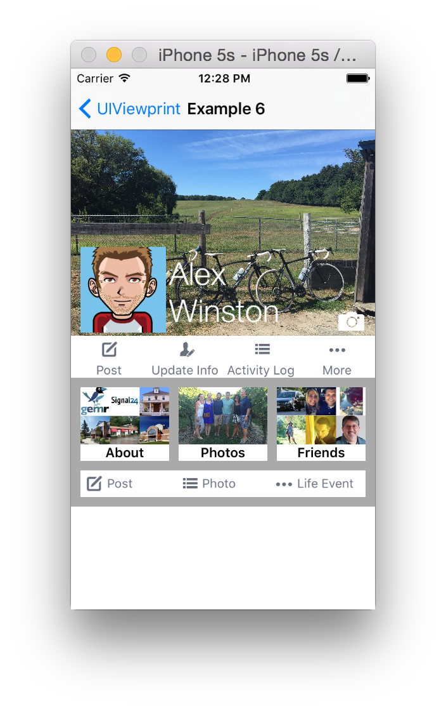

# &lt;UIViewprint/&gt;
[](https://developer.apple.com/swift)

[](https://github.com/s4cha/Stevia/blob/master/LICENSE)


iOS view layout completely reimagined

> **Blueprint** /ˈbluːˌprɪnt/ : a detailed outline or plan of action:
a blueprint for success.


```
class ViewController: UIScrollViewableController {
    
    var sellerLabel:UIViewable?
    var categoryLabel:UIViewable?
    var compatibilityLabel:UIViewable?

    override func viewDidLoad() {
        super.viewDidLoad()

        let appDetails = AppDetails()
        appDetails.name = "Day One 2 Journal + Notes"
        appDetails.developer = "Bloom Built, LLC"
        appDetails.rating = " 4+"
        appDetails.category = "Lifestyle"
        appDetails.price = "4.99"
        appDetails.reviews = 385
        appDetails.editorsNotes = "It's hard to make the best even better, but the sequel to Day One lives up to the expectations -- and then some."

        super.scrollView.addSubview(
            div(style(padding:(10,0,0,0)),
                div(style(display:.Flex(.Row), padding:(0,right:10,0,10)),
                    image("logo", style:style(width:80, height:80), appearance:logoStyle),
                    div(style(padding:(0,0,0,10)),
                        div(.Flex(.Row),
                            label(appDetails.name),
                            label(appDetails.rating, style:style(width:20, padding:(0,right:10,0,0)), appearance:ratingLabelStyle)
                        ),
                        div(
                            label("\(appDetails.developer)", font:.systemFontOfSize(12)),
                            label(" >", font:.systemFontOfSize(11))
                        ),
                        div(
                            label("Editors' Choice", style:style(padding:(1,5,1,5)), appearance:editorsChoiceLabelStyle)
                        ),
                        div(style(display:.Flex(.Row)),
                            div(style(display:.Flex(.Row), align:.Bottom(.Left)),
                                div(style(display:.Flex(.Row), align:.Middle(.Left), width:55), subviews:
                                    div(foreach:[Int](1...5)) { (i:Int) in
                                        return StarView(frame:CGRect(x:0, y:0, width:10, height:10))
                                    }
                                ),
                                label("(\(appDetails.reviews))", font:.systemFontOfSize(10))
                            ),
                            div(style(width:52, height:24), appearance:priceStyle,
                                label("+", font:.boldSystemFontOfSize(8), style:style(align:.Top(.Left), padding:(0,0,0,3))),
                                label("$\(appDetails.price)", font:.boldSystemFontOfSize(12)).align(.Middle(.Left))
                            )
                        )
                    )
                ),
                div(style(display:.Flex(.Row), padding:(10,10,0,10)),
                    image("logo", style:style(width:15,height:15), appearance:watchLogoStyle),
                    label("Offers Apple Watch App for iPhone", style:style(align:.Middle(.Left), padding:(0,0,0,5)), appearance:watchLabelStyle)
                ),
                segment(style(align:.Top(.Center), padding:(10,0,0,0)), items:["Details", "Reviews", "Related"], color:.grayColor()),
                hr(padding:(top:10,0,0,0), color:.lightGrayColor()),
                div(style(padding:(0,0,0,left:10)),
                    div(style(height:40),
                        label("App Store Editors' Notes").align(.Middle(.Left))
                    ),
                    label(appDetails.editorsNotes, style:style(display:.Block), font:.systemFontOfSize(12)),
                    hr(padding:(top:10,0,0,0), color:.lightGrayColor()),
                    div(style(display:.Flex(.Row), padding:(top:10,0,0,0)),
                        image("gamecenter").width(30).height(30),
                        div(style(padding:(0,0,0,left:10)),
                            label("Game Center", font:.systemFontOfSize(12), style:style(display:.Block)),
                            label("Challenge friends and check leaderboards and achievements.", style:style(display:.Block), appearance:informationLabelStyle)
                        )
                    ),
                    hr(padding:(top:10,0,bottom:10,0), color:.lightGrayColor()),
                    label("Information", style:style(display:.Block)),
                    div(style(padding:(top:5,0,0,0)),
                        informationItem(&sellerLabel, title:"Seller", description:appDetails.developer),
                        informationItem(&categoryLabel, title:"Category", description:appDetails.category),
                        informationItem(&compatibilityLabel, title:"Compatibility", description:"Requires iOS 9.0 or later. Compatible with iPhone, iPad, and iPos touch.")
                    )
                )
            )
        )
    }

    func informationItem(inout view:UIViewable?, title:String, description:String) -> UIViewable {
        return
            div(.Flex(.Row),
                div(&view, style(padding:(0,right:10,0,0)),
                    label(title, appearance:informationLabelStyle).align(.Top(.Right))
                ),
                label(description, font:.systemFontOfSize(12))
            )
    }

    func layerStyle(layer:CALayer, borderWidth:CGFloat, borderColor:UIColor, cornerRadius:CGFloat = 0) {
        layer.borderWidth = borderWidth
        layer.borderColor = borderColor.CGColor
        layer.cornerRadius = cornerRadius
    }

    func logoStyle(view:UIImageView) {
        layerStyle(view.layer, borderWidth:0.5, borderColor:.grayColor(), cornerRadius:15.0)
        view.clipsToBounds = true
    }

    func watchLogoStyle(view:UIView) {
        layerStyle(view.layer, borderWidth:0.5, borderColor:.grayColor(), cornerRadius:7.5)
        view.clipsToBounds = true
    }

    func watchLabelStyle(label:UILabel) {
        label.textColor = UIColor(red: 106/255.0, green: 113/255.0, blue: 127/255.0, alpha: 1.0)
        label.font = .boldSystemFontOfSize(10.0)
    }

    func ratingLabelStyle(label:UILabel) {
        layerStyle(label.superview!.layer, borderWidth:1, borderColor:.grayColor())
        label.textColor = .lightGrayColor()
        label.font = .systemFontOfSize(11)
        label.textAlignment = .Right
    }

    func editorsChoiceLabelStyle(label:UILabel) {
        label.superview!.backgroundColor = .grayColor()
        label.superview!.layer.cornerRadius = 7
        label.superview!.clipsToBounds = true
        
        label.textColor = .whiteColor()
        label.font = .systemFontOfSize(10.0)
    }

    func priceStyle(view:UIView) {
        layerStyle(view.layer, borderWidth:1, borderColor:view.self.tintColor!, cornerRadius:4.0)
        view.clipsToBounds = true
    }

    func informationLabelStyle(label:UILabel) {
        label.textColor = .lightGrayColor()
        label.font = .systemFontOfSize(12.0)
    }

    override func viewWillLayoutSubviews() {
        super.viewWillLayoutSubviews()
        
        let informationItemWidth = CGFloat(self.view.frame.width * 0.3)
        self.sellerLabel!.width(informationItemWidth)
        self.categoryLabel!.width(informationItemWidth)
        self.compatibilityLabel!.width(informationItemWidth)
    }
}
```

## Disclaimer

**UIViewprint** is currently in Beta and pushes various Swift language features to the absolute limit. Swift is an amazing language and I have been pleasently surprised with what is possible and the performance the runtime provides.

**This was previously a thought experiment to demonstrate how layout can be simplified with Swift operator overloading. This layout syntax has now been deprecated in favor of a more editor friendly syntax.**

In addition this project attemps to borrow ideas from React Native but tailored specifically to iOS.

## Deprecated syntax
The operator overloading syntax that this project initially used has now been deprecated.  Although it was fascinating to see how far operator overloading could be pushed it was all that useful in a practical sense.  Especially considering how often it crashed the Xcode editor and the problems with code alignment.

### Example 6 deprecated syntax

```
var emailTextField:UITextField?
var passwordTextField:UITextField?
    
self.view
    < .flexColumn()+>
        < .view>>
        < .flexRow()+>
            < .view(.style(width:10))>>
            < .view+>
                < .input(&emailTextField, "Email", style:largeRoundedStyle)>>
                < .view(.style(height:10))>>
                < .input(&passwordTextField, "Password", style:largeRoundedStyle)>>
            < .view/>
            < .view(.style(width:10))>>
        < .view/>
        < .view>>
        < .view+>
            < .button("Login", display:.Flex(.Row), height:80, touch:login).align(.Bottom(.Left))>>
        < .view/>
    < .view/>
 
func login(button:UIButton) {
    print(emailTextField!.text)
}
    
func largeRoundedStyle(view:UIView) {
    if let textField = view as? UITextField {
        textField.borderStyle = .RoundedRect
        textField.frame.size.height = 60
        textField.font = UIFont(name: "HelveticaNeue-Light", size: 26)
    }
}

```

## The Basics
UIViewprint grew out of various shortcomings and frustrations with Interface Builder, Auto Layout, Stack Views and the myriad of Swift frameworks that attempt to make Auto Layout easier. In an effort to reimagine how layout could be improved a structure similar to HTML and CSS was adopted given it's ubiquity and surprising ability to model heirarchical views quite well.

### Example 1
UIViewprint can be utilized from a controller or any code that initializes a view. In the examples below a basic UIViewController is assumed.

```
override func viewDidLoad() {
    super.viewDidLoad()
    
    self.view
    	// Could use UIView.view if Xcode complains about ambiguities
        < .view>>
}
```

In this particular example a blank "block" style view is added as a subview to the controllers view.  Because it does not contain any children or have a specified height nothing is displayed. Of interest however is the two overloaded operators "<" and ">>".

The overloaded infix operator "<" is used to trigger the addition of a subview.  In this case to the controllers view.  The UIView.view is an extension that provides a simple way to initialize a new view (UIViewable).
The overloaded postfix operator ">>" is used to trigger the close of the view.  This is somewhat analogous to &lt;div&gt;&lt;/div&gt;


### Example 2

In this example a view is added to the top of the controllers view with a height of 10 and width of the controllers view.  By default UIViewables are displayed as "block" elements and as such expand to fill the width of the parent view.

```
override func viewDidLoad() {
    super.viewDidLoad()
    
    self.view
        < .view(.style(height:10, backgroundColor:.orangeColor()))>>
        // This is shorthand for UIViewable().style(height:10)
}
```


### Example 3

In this example UILabels are introduced as well as several more overloaded operators

```
override func viewDidLoad() {
    super.viewDidLoad()
    
    self.view
        < .view+>
            < "Label 1">>
            < "Label 2">>
            < "Label 3"==.display(.Block)>>
        < .view/>
}
```


Of interest is the fact that by default UILabels are analogous to "inline" elements.  Label 1 and label 2 align inline.  Label 3 is pushed below the previous labels because it's display property has been set to "block".

Additionally the "+>" and "/>" operators have been introduced.

The "+>" operator is used to "open" a new view so subviews can be added. 
The "/>" operator is used to close the view that was previously opened.

This is similar to the following HTML

```
	<div>
		Label 1
		Label 2
		<div>Label3</div>
	</div>
```

## Flex rows

Flex rows are similar to an HTML flex container with flex row items. Unlike  CSS flexbox layout, views within a flex row are automatically divided equally among the parent views width unless a view specifically defines a width.

### Example 4

```
override func viewDidLoad() {
    super.viewDidLoad()
    
    self.view
        < .flexRow()+>
            < "Label 1">>
            < "Label 2">>
            < "Label 3">>
        < .view/>
}
```


As expected three evenly spaced views have been created that each contain the specified label.  The views within a flex row are by default aligned top left.

If however the first label specifies a width of 100 then the remaining views divide the space evenly after accounting for the fixed width view.

```
override func viewDidLoad() {
    super.viewDidLoad()
    
    self.view
        < .flexRow()+>
            < "Label 1"==.width(100)>>
            < "Label 2">>
            < "Label 3">>
        < .view/>
}
```

## Flex columns

Flex columns are similar to to flex rows but stretch along the Y axis. Views within a flex column are automatically divided equally among the parent views height unless a view specifically defines a height.

### Example 5

```
override func viewDidLoad() {
    super.viewDidLoad()
    
    self.view
        < .flexColumn()+>
            < .view+>
                < "Label 1">>
            < .view/>
            < .view+>
                < "Label 2">>
            < .view/>
            < .view+>
                < "Label 3">>
            < .view/>
        < .view/>
}
```


## Padding
UIViewprint provides CSS padding like functionality that can be defined for each UIViewable.  The example below adds padding around two subviews with the inner most defining a label.

```
div(style(padding:(top:10, right:10, bottom:10, left:10), backgroundColor:.orangeColor()),
	div(style(padding:(top:10, right:10, bottom:10, left:10), backgroundColor:.yellowColor()),
		label("Padded").backgroundColor(.lightGrayColor())
	)
)
``` 


## UITablewView support
UIViewprint now provides rather robust table view support however some complex edge cases can still be difficult. The easiest way to develop table views in UIViewprint is to use the UITableViewableController class.  This subclass of the UITableViewController provides a number of convenience methods in addition to various important boilerplate code that provides impressive performance out of the box.

### Static table
The example code below demonstrates how to create a simple static table that simply renders a number of predefined rows. In addition to easily defining a table header and footer, multiple sections can be defined in addition to variable sized cell "rows" that are intelligently cached and resized appropriately during orientation changes. Row selectors can be defined per section.

```
class ViewController: UITableViewableController {
	override func viewDidLoad() {
	    super.viewDidLoad()
	    
	    self.title = "Static table"
	    self.edgesForExtendedLayout = UIRectEdge.None;
	    
	    self.table(
	        header: label("Header"),
	        sections: [
	            section(touchRow,
	                header: "Section One",
	                rows: [
	                    row(
	                        div(
	                            label("Left 1"),
	                            label("Right 1").align(.Top(.Right))
	                        )
	                    ),
	                    row(label("Row 2")),
	                    row(label("Row 3")),
	                    row(label("Row 4")),
	                    row(label("Row 5")),
	                    row(
	                        div(
	                            label("Left 6"),
	                            label("Right 6").align(.Top(.Right))
	                        )
	                    )
	                ]
	            ),
	            section(touchRow,
	                header: "Section Two",
	                rows: [
	                    row(
	                        div(
	                            label("Left 2-1"),
	                            label("Right 2-1").align(.Top(.Right))
	                        )
	                    ),
	                    row(label("Row 2-2")),
	                    row(label("Row 2-3")),
	                    row(label("Row 2-4")),
	                    row(label("Row 2-5")),
	                    row(
	                        div(
	                            label("Left 2-6"),
	                            label("Right 2-6").align(.Top(.Right))
	                        )
	                    )
	                ]
	            )
	        ],
	        footer: div(style(height:100, backgroundColor:.yellowColor()),
	            label("Foot 1").backgroundColor(.grayColor()),
	            label("Foot 2").align(.Top(.Right)).backgroundColor(.orangeColor())
	        )
	    )
	}
	    
	func touchRow(indexPath:NSIndexPath) {
	    print("touch \(indexPath.section) \(indexPath.row)")
	}
}
```

### Basic datasource table
The UITableViewableController provides a number of convenience methods to support various types of datasources.  In the example below an array of Example objects is registered with the table controller through the "foreach" parameter of the section method.

A crude copy of the UITableViewCellStyleDefault is provided through the defaultTableViewCell method.  It should be noted however that the UITableViewableController does not work with cells.  It instead works with UIViewable which is a subclass of UIView.

```
class UIViewController: UITableViewableController {

    let examples: [ExampleControllerDetails] = [
        Example(name:"Example 1", controller:ViewController1.self),
        Example(name:"Example 2", controller:ViewController2.self),
        Example(name:"Example 3", controller:ViewController3.self)
    ]
    
    override func viewDidLoad() {
        super.viewDidLoad()
        
        self.title = "UITableView examples"
        self.edgesForExtendedLayout = UIRectEdge.None;
        
        self.table(
            sections: [
                section(selectExample, foreach:examples) { (example:AnyObject) in
                    let example = example as! Example
                    return self.defaultTableViewCell(example.name)
                }
            ]
        )   
    }
    
    func selectExample(indexPath:NSIndexPath) {
        let controller:UIViewController = self.examples[indexPath.row].controller.init()
        controller.view.frame = view.bounds
        controller.view.backgroundColor = .whiteColor()
        controller.view.autoresizingMask = [UIViewAutoresizing.FlexibleWidth, UIViewAutoresizing.FlexibleHeight]
        
        self.navigationController?.pushViewController(controller, animated: true)
    }
}
```

### Advanced datasource table
Complex datasource driven tables are also possible with UIViewprint.  Although this functionality does not support every possible use case it currently provides robust support for a large majority of scenarios.

The example below is the beginnnings of an App Store Editors' Choice table view. The header is "sticky" and the table supports basic swipe to delete capabilities. 

```
class ViewController: UITableViewableController {

    override func viewDidLoad() {
        super.viewDidLoad()

        self.title = "Datasource example"
        self.edgesForExtendedLayout = UIRectEdge.None;

        let apps:[App] = [
            App(name:"iSlash Heroes"),
            App(name:"Tomb of the Mask"),
            App(name:"Day One 2 Journal + Notes + diary"),
            App(name:"twofold inc."),
            App(name:"Guides by Lonely Planet"),
            App(name:"Dungelot: Shattered Lands")
        ]

        self.table(
            header: div(style(height:100, backgroundColor:.lightGrayColor()),
                label("Editors' Choice", style:style(align:.Middle(.Center)))
            ),
            sections: [
                section(touchRow,
                    rows: [
                        row(
                            label("Our editors continually sift through the latest releases and updates, recognizing the most invaluable apps and the most entertaining games as Editors' Choice selections.").display(.Block)
                        )
                    ]
                ),
                section(touchRow, foreach:apps) { (app:AnyObject) in
                    let app = app as! App
                    return div(
                        div(style(height:10)),
                        div(.Flex(.Row),
                            div(style(width:10)),
                            div(
                                label("\(app.name)")
                            )
                        ),
                        div(style(height:10))
                    )
                }
            ],
            footer: div(
                button("Redeem", touch:handleRedeem),
                button("Send Gift", touch:handleSendGift)
            )
        )

    }

    func touchRow(indexPath:NSIndexPath) {
        print("touch \(indexPath.section) \(indexPath.row)")
    }
    
    func handleRedeem(button:UIButton) {
    }
    
    func handleSendGift(button:UIButton) {
    }
}
```

## Advanced features

### Example 6

This example demonstrates how layout compares to the popular [Stevia](https://github.com/s4cha/Stevia) framework.  UIViewprint currently doesn't support the concept of padding.  If this were to be added this example could be further simplified.

```swift
var emailTextField:UITextField?
var passwordTextField:UITextField?

override func viewDidLoad() {
    super.viewDidLoad()

    self.title = "Example 6"
    self.edgesForExtendedLayout = UIRectEdge.None;
    
    self.view.addSubview(
        div(.Flex(.Column),
            div(),
            div(style(padding:(0,right:10,0,left:10)),
                input(&emailTextField, placeholder:"Email", style:style(padding:(0,0,bottom:5,0)), appearance:largeFontRoundedCorners),
                input(placeholder:"Password", appearance:largeFontRoundedCorners)
            ),
            div(),
            div(
                button("Login", display:.Flex(.Row), align:.Bottom(.Left), height:80, touch:login)
            )
        )
    )
}

func roundedCorners(textField:UITextField) {
    textField.borderStyle = .RoundedRect
}
    
func login(button:UIButton) {
    print(emailTextField!.text)
}
    
func largeFontRoundedCorners(view:UIView) {
    if let textField = view as? UITextField {
        textField.borderStyle = .RoundedRect
        textField.frame.size.height = 54
        textField.font = UIFont(name: "HelveticaNeue-Light", size: 26)
        textField.returnKeyType = .Done
    }
}
```

Of particular interest is the ability to associate wrapped components to variables via inout parameters. It is also easy to bind touch events to targets within the markup directly via "touch:login" as a parameter to the .button function. Additionally function callbacks allow styles to be reused across components and views.


### Example 6a

This example demonstrates a UIViewprint implementation of the Facebook profile page developed to highlight the features of the [Neon](https://github.com/mamaral/Neon) framework. Unlike Neon however all the code required to layout the view is listed below.
 
```
class ViewController: UIViewableController {
    var bannerView:UIViewable = UIViewable()
    var avatarImageView:UIViewable?
    
    override func viewDidLoad() {
        super.viewDidLoad()
        
        bannerView.layer.contents = UIImage(named:"banner")?.CGImage
        
        self.view
            < .view(.style(backgroundColor:.lightGrayColor()))+>
                < bannerView+>
                    < .view(.style(.Flex(.Row), align:.Bottom(.Left)))+>
                        < .view(.style(.Flex(.Row)))+>
                            < width(10)>>
                            < image(&avatarImageView, name:"avatar")>>
                            < .view(.style(align:.Middle(.Left)))+>
                                < label("Alex", display:.Block, style:avatarNameStyle)>>
                                < label("Winston", display:.Block, style:avatarNameStyle)>>
                            < .view/>
                        < .view/>
                        < image("camera").align(.Bottom(.Left)).width(30).height(30)>>
                        < width(10)>>
                    < .view/>
                < .view/>
                < UIViewable().display(.Flex(.Row))+>
                    < buttonBarItemView("Post", labelAlign:.Top(.Center), imageName:"post", imageDisplay:.Block, imageAlign:.Top(.Center))>>
                    < buttonBarItemView("Update Info", labelAlign:.Top(.Center), imageName:"updateInfo", imageDisplay:.Block, imageAlign:.Top(.Center))>>
                    < buttonBarItemView("Activity Log", labelAlign:.Top(.Center), imageName:"activityLog", imageDisplay:.Block, imageAlign:.Top(.Center))>>
                    < buttonBarItemView("More", labelAlign:.Top(.Center), imageName:"more", imageDisplay:.Block, imageAlign:.Top(.Center))>>
                < .view/>
                < height(10)>>
                < UIViewable().display(.Flex(.Row))+>
                    < width(10)>>
                    < imageLabelView("About", imageName:"about")>>
                    < width(10)>>
                    < imageLabelView("Photos", imageName:"photos")>>
                    < width(10)>>
                    < imageLabelView("Friends", imageName:"friends")>>
                    < width(10)>>
                < .view/>
                < height(10)>>
                < UIViewable().display(.Flex(.Row))+>
                    < width(10)>>
                    < buttonBarItemView("Post", imageName:"post")>>
                    < buttonBarItemView("Photo", imageName:"activityLog")>>
                    < buttonBarItemView("Life Event", imageName:"more")>>
                    < width(10)>>
                < .view/>
                < height(10)>>
            < .view/>
    }
    
    func buttonBarItemView(labelText:String, labelAlign:UIViewableAlign? = .Middle(.Left), imageName:String, imageDisplay:UIViewableDisplay? = .Inline, imageAlign:UIViewableAlign? = .Top(.Left)) -> UIView {
        func buttonLabelStyle(label:UILabel) {
            label.textColor = UIColor(red: 106/255.0, green: 113/255.0, blue: 127/255.0, alpha: 1.0)
            label.font = .systemFontOfSize(13.0)
        }
        
        return UIViewable().backgroundColor(.whiteColor())
            < image(imageName).display(imageDisplay!).align(imageAlign!).width(28).height(28)>>
            < label(labelText, style:buttonLabelStyle).align(labelAlign!)>>
    }
    
    func imageLabelView(labelText:String, imageName:String) -> UIView {
        func imageLabelStyle(label:UILabel) {
            label.textColor = UIColor.blackColor()
            label.font = UIFont.boldSystemFontOfSize(14.0)
        }
        
        return UIViewable().backgroundColor(.whiteColor())
            < image(imageName, contentMode:.ScaleAspectFill).display(.Block).align(.Top(.Center)).height(60)>>
            < label(labelText, style:imageLabelStyle).align(.Top(.Center))>>
    }

    func avatarNameStyle(label:UILabel) {
        label.font = UIFont(name: "HelveticaNeue-Light", size: 33)
        label.textColor = .whiteColor()
    }

    override func viewWillLayoutSubviews() {
        super.viewWillLayoutSubviews()
        
        let isLandscape:Bool = UIDevice.currentDevice().orientation.isLandscape.boolValue
        let bannerHeight:CGFloat = self.view.frame.height * 0.43
        let avatarHeightMultipler:CGFloat = isLandscape ? 0.75 : 0.43
        let avatarSize = bannerHeight * avatarHeightMultipler
        
        self.bannerView.height(bannerHeight)
        self.avatarImageView!.width(avatarSize).height(avatarSize)
    }
}
```



## View alignment

UIViewprint makes view alignment within a parent relatively painless. Views can be aligned vertically (Top, Middle, Bottom) and horizontally (Left, Center, Right).

### Example 7

```
self.view
    < .flexColumn()+>
        < .flexRow()+>
            < .flexColumn()+>
                < label("Top Left").align(.Top(.Left)).backgroundColor(.yellowColor())>>
            < .view/>
            < .flexColumn()+>
                < label("Top Center").align(.Top(.Center)).backgroundColor(.orangeColor())>>
            < .view/>
            < .flexColumn()+>
                < label("Top Right").align(.Top(.Right)).backgroundColor(.redColor())>>
            < .view/>
        < .view/>
        < .view(style(.Flex(.Row), backgroundColor:.lightGrayColor()))+>
            < .flexColumn()+>
                < label("Mid Left").align(.Middle(.Left)).backgroundColor(.yellowColor())>>
            < .view/>
            < .flexColumn()+>
                < label("Mid Center").align(.Middle(.Center)).backgroundColor(.orangeColor())>>
            < .view/>
            < .flexColumn()+>
                < label("Mid Right").align(.Middle(.Right)).backgroundColor(.redColor())>>
            < .view/>
        < .view/>
        < .flexRow()+>
            < .flexColumn()+>
                < label("Bottom Left Test").align(.Bottom(.Left)).backgroundColor(.yellowColor())>>
            < .view/>
            < .flexColumn()+>
                < label("Bottom Ctr").align(.Bottom(.Center)).backgroundColor(.orangeColor())>>
            < .view/>
            < .flexColumn()+>
                < label("Bottom Right").align(.Bottom(.Right)).backgroundColor(.redColor())>>
            < .view/>
        < .view/>
    < .view/>
```


## TODO
* Consider using SwiftBox for better layout and performance

## Contact
Twitter: [@alex_winston](https://twitter.com/alex_winston)